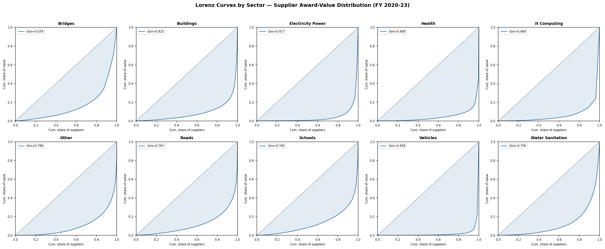
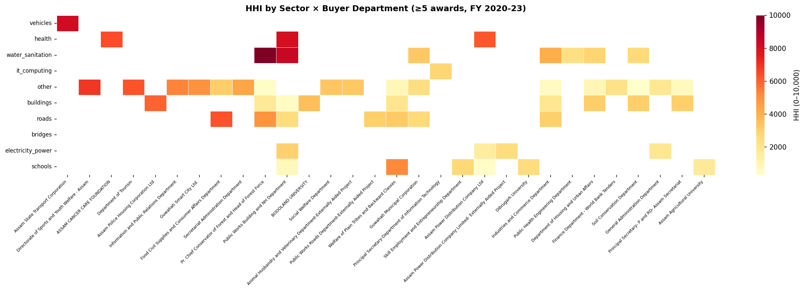
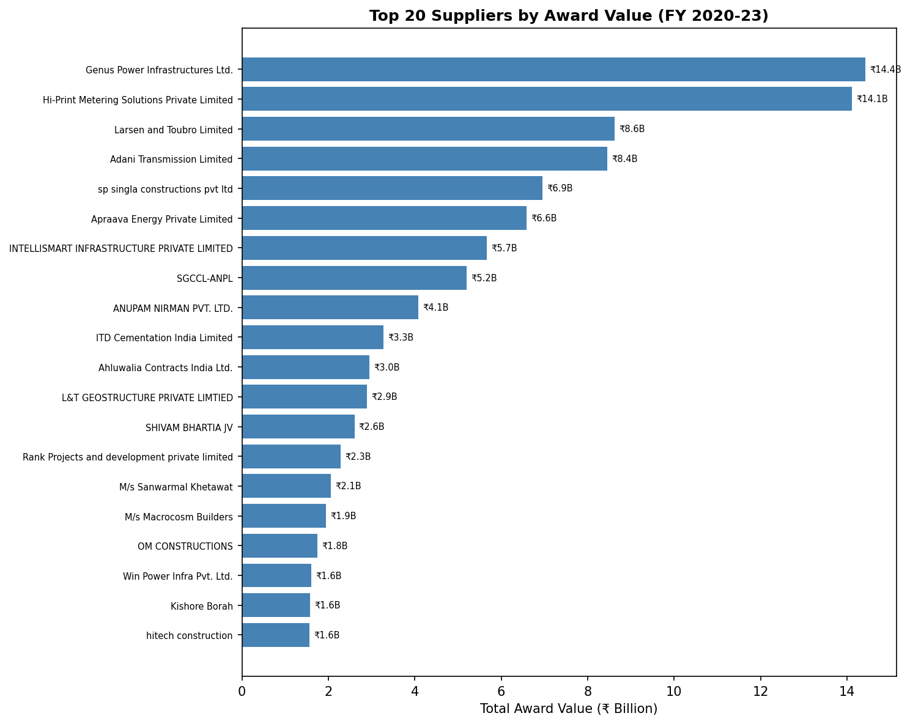
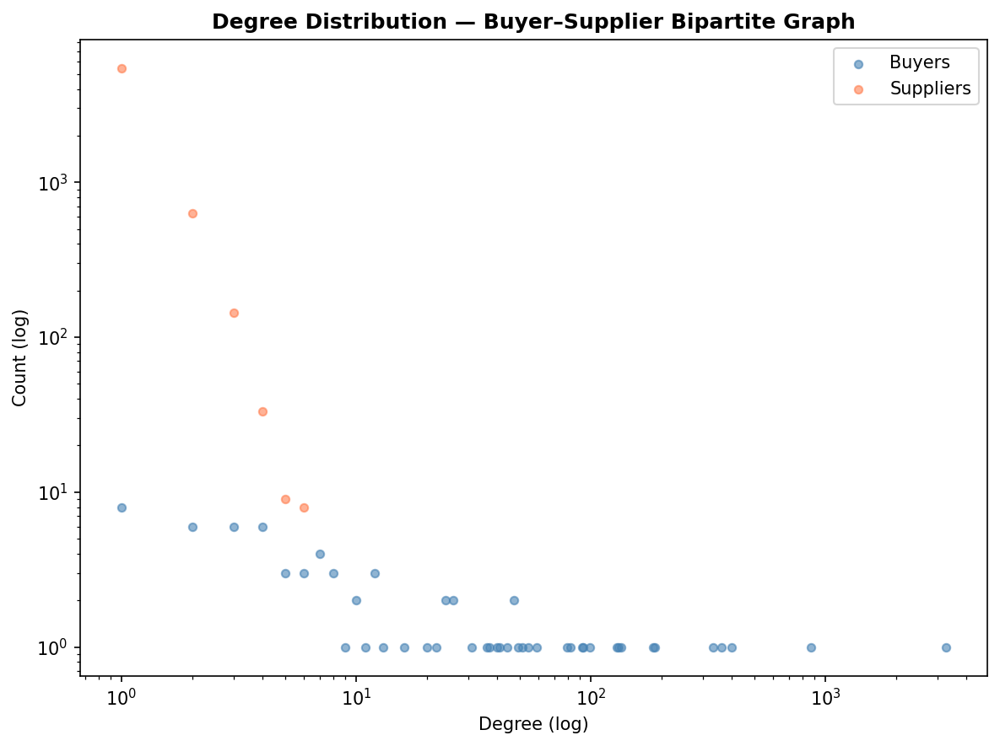
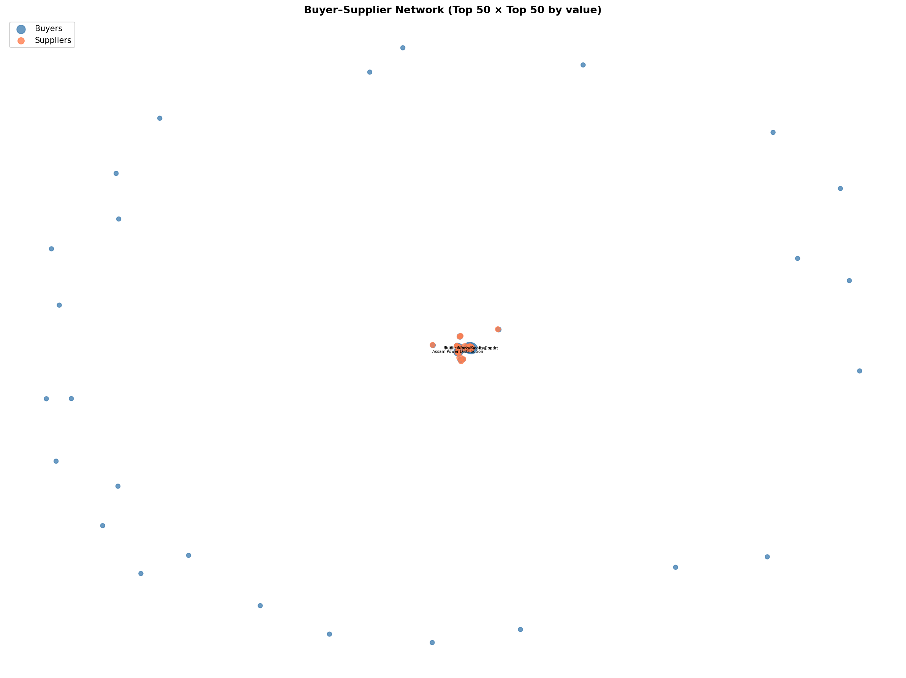
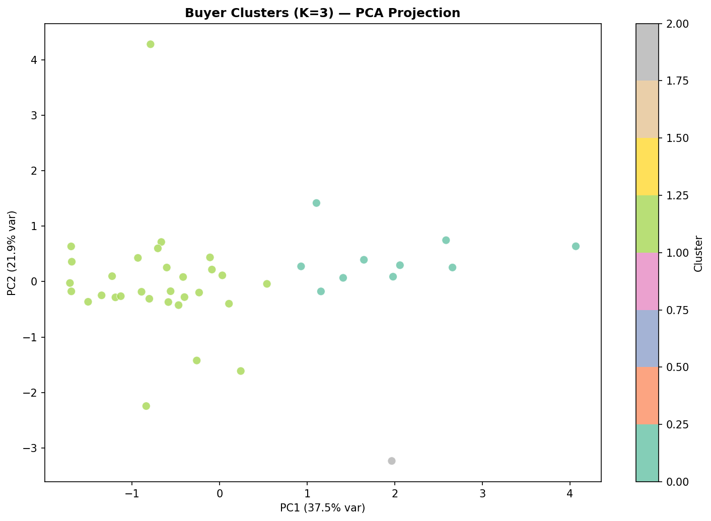
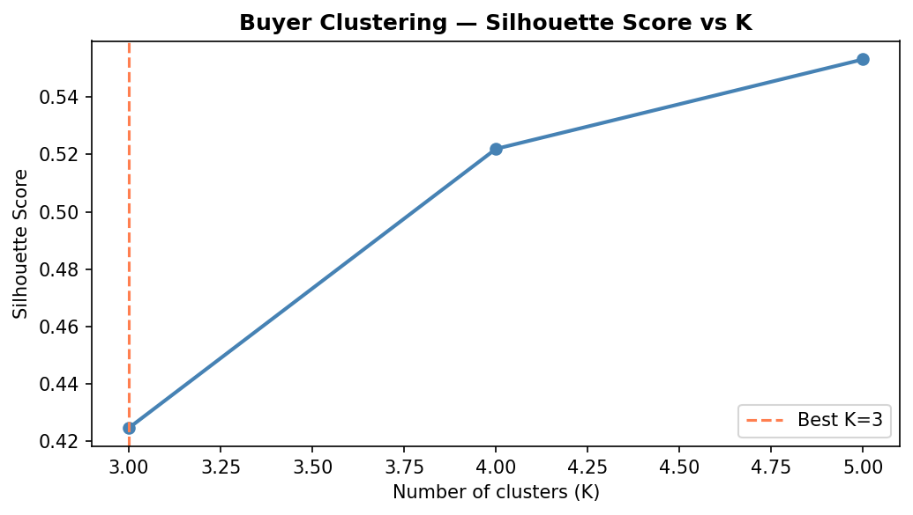

# Chapter A: Concentration and Competition Analysis

This chapter addresses Research Question 1 (RQ1): *How concentrated is Assam's public procurement market in FY 2020–23, and does concentration vary systematically across derived sectors, buyer departments, and districts?*

## 1. Motivation
Public procurement accounts for a substantial portion of public expenditure. Concentration of awards among a few suppliers or within specific departments can indicate a lack of competition, potential capture, or structural barriers to entry. Understanding this concentration is a critical first step in evaluating the health of the procurement ecosystem.

## 2. Methodology
The analysis focuses on the awarded subset of tenders from FY 2020-21 through FY 2022-23.

* **Selection Bias Note**: The results describe the awarded subset of tenders. A significant portion of tenders (over 70%) lack award data, primarily due to inconsistent publication. 
* **Data Exclusion**: Placeholder award values (₹0 and ₹1), commonly used in empanelment and rate-contract tenders, are excluded from value-based metrics (HHI, Gini, CR-N) to prevent distortion, but are retained for count-based and network metrics.

**Metrics Computed**:
1. **Herfindahl-Hirschman Index (HHI)**: Measures market concentration by summing the squared market shares of all suppliers, scaled to 0-10,000.
2. **Gini Coefficient and Lorenz Curves**: Quantify inequality in the distribution of award values across suppliers. A Gini of 0 represents perfect equality; 1 represents absolute inequality (monopoly).
3. **Concentration Ratios (CR4, CR10)**: The combined market share of the top 4 and top 10 suppliers.
4. **Bipartite Network Analysis**: A graph where buyers and suppliers are nodes. We compute degree distribution, eigenvector centrality, and unweighted betweenness centrality to identify key hubs and topological brokers.
5. **Buyer Clustering (K-Means)**: Buyers with at least 30 recorded tenders are clustered based on behavioral features like median tender value, bidder count, single-bidder rate, supplier HHI, and procurement method.

## 3. Findings

### 3.1 Gini Coefficient & Lorenz Curves
The overall Gini coefficient for supplier award values indicates high inequality across the market. The Lorenz curves by sector show that some sectors have more egalitarian distributions, while others are highly skewed towards top suppliers.

### 3.2 Herfindahl-Hirschman Index (HHI)
HHI analysis reveals substantial variance between sectors and buyers. Certain specialized sectors naturally exhibit higher concentration, but extreme HHI values at the buyer level suggest localized monopolies or captive supplier relationships.

### 3.3 Concentration Ratios & Top Suppliers
The CR4 and CR10 ratios show that in several key sectors, over half of the procurement value flows to the top 10 suppliers. 

### 3.4 Bipartite Network & Centrality
The buyer-supplier network exhibits a heavy-tailed degree distribution typical of complex networks, where a few "hub" suppliers serve many buyers. We calculate unweighted betweenness centrality for buyers, which highlights topological brokerage—the frequency a buyer sits on the shortest path between suppliers—identifying departments that act as critical bridging points across the procurement ecosystem.

### 3.5 Buyer Typology — K-Means Clustering
To identify structural patterns in procurement behaviour, we clustered the 41 buyers with at least 30 recorded tenders using K-Means on six features: median tender value, mean bidder count, single-bidder rate, supplier HHI, open-tender share, and repeat top-3 supplier share. The optimal number of clusters was selected as K=4 (Silhouette = 0.55), with a singleton guard applied to prevent outlier isolation from inflating the silhouette score at higher K values.

The four clusters and their mean feature profiles are as follows:

- **Cluster 0 — Competitive Mainstream (n=27 buyers)**. Median tender value ₹11.6M, mean bidder count 5.3, supplier HHI 869, top-3 supplier share 37%, open-tender share 97%. This cluster contains the majority of active buyers and represents the reference competitive profile: procurement is conducted primarily through open tenders, award values are distributed across a broad supplier base, and no single supplier group dominates. APDCL merges into this cluster at the buyer aggregate level, though Chapter B identifies elevated structural risk in APDCL's electricity portfolio specifically — illustrating that buyer-level typologies can mask sector-specific patterns.
- **Cluster 1 — Captured-Supplier Buyers (n=10 buyers)**. Median tender value ₹6.4M, mean bidder count 5.1, supplier HHI 4,533, top-3 supplier share 92%, open-tender share 99%. This cluster is the most analytically significant finding from the typology analysis. Buyers here match Cluster 0 almost exactly on process indicators — similar bidder counts, near-identical open-tender usage — but award outcomes concentrate dramatically in three or fewer suppliers, with HHI more than five times higher than the competitive mainstream. This pattern is consistent with incumbent advantage or structural barriers to winning at the award stage rather than the tendering stage: procurement process integrity does not, by itself, prevent supplier capture.
- **Cluster 2 — Restricted-Method Users (n=3 buyers)**. Median tender value ₹6.9M, mean bidder count 4.6, supplier HHI 1,103, top-3 supplier share 48%, open-tender share 76%. The defining characteristic of this cluster is the open-tender share of 76%, which is 20 percentage points below every other cluster. These three buyers resort to limited, single-source, or other non-open methods for roughly one in four tenders — a rate approximately four times higher than the competitive mainstream. This elevated non-open-method share is the primary driver of their structural risk flags in Chapter B.
- **Cluster 3 — Empanelment-Driven Outlier (n=1 buyer, Public Health Engineering Department)**. Median tender value ₹0 (empanelment rate-contract placeholders), mean bidder count 118, supplier HHI 2,263, top-3 supplier share 80%. PHED — the Public Health Engineering Department — is isolated as a singleton because its procurement model is structurally distinct from all other buyers: it primarily issues empanelment panels that pre-qualify large numbers of contractors rather than conducting individual open tenders. The ₹0 median tender value reflects the ₹1 placeholder convention used for empanelment contracts whose per-call-off values are determined later; the 118 average bidder count reflects the empanelment list size, not a competitive tender field. This cluster should be interpreted as a methodological outlier rather than a behavioural typology; PHED's procurement outcomes require a separate analytical framework to assess fairly.

A note on feature contribution. The `single_bidder_rate` feature contributed negligibly to cluster separation — values were near zero for all clusters after rounding — because single-bidder tenders constitute a small fraction of any individual buyer's portfolio when aggregated across sectors. Cluster differentiation was driven primarily by `supplier_hhi`, `repeat_top3_supplier_share`, and `median_tender_value`. This does not invalidate the clustering but means the typology captures award-outcome concentration patterns more than tendering-process anomalies; the latter are better captured by the buyer × sector composite scores in Chapter B.

## 4. Limitations
* **Selection Bias**: The high rate of missing award data restricts our claims to "awarded procurements" rather than all tendered intent.
* **Placeholder Values**: Excluding ₹0/₹1 awards removes about half the award lines from value metrics, potentially undercounting the influence of rate-contract suppliers.
* **Classifier Accuracy**: The sector classification relies on keyword and buyer mapping, which may miscategorize mixed-use or vaguely titled tenders.

## 5. Implications for Recommendations
The observed concentration levels, particularly the variance between buyers in similar sectors, suggest that competition is heavily influenced by departmental procurement practices. High-HHI and high-Gini environments warrant targeted interventions, such as unbundling large contracts to encourage SME participation and standardizing procurement methods to lower entry barriers.
