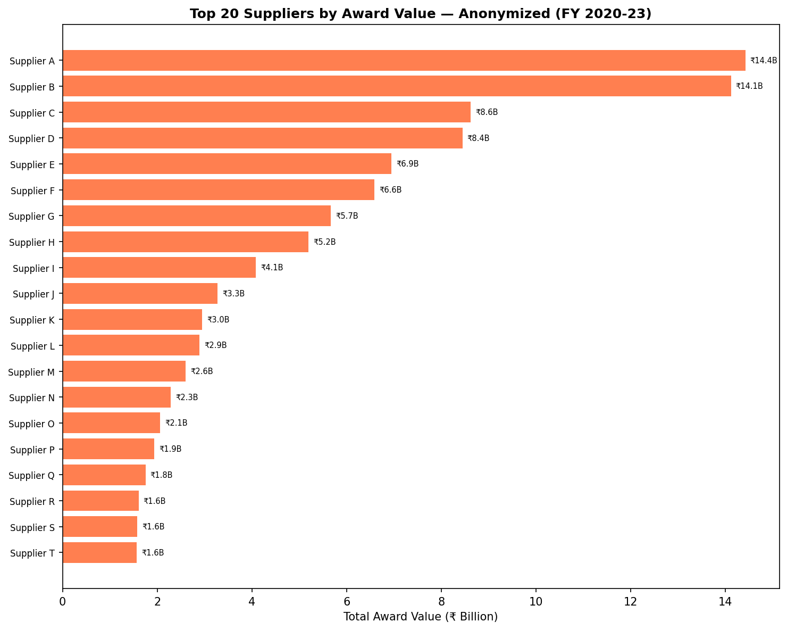
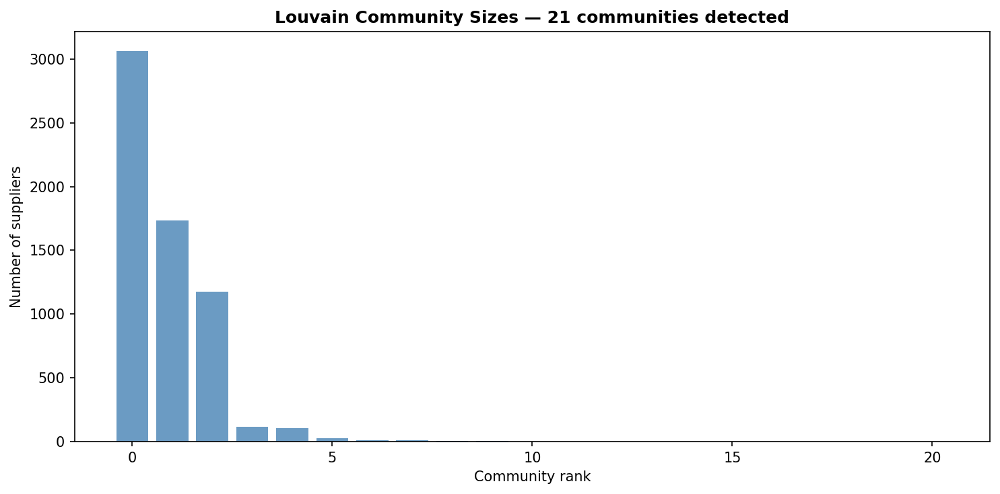

# Chapter A: Concentration and Competition Analysis

This chapter addresses Research Question 1 (RQ1): *How concentrated is Assam's public procurement market in FY 2020–23, and does concentration vary systematically across derived sectors, buyer departments, and districts?*

## 1. Motivation
Public procurement accounts for a substantial portion of public expenditure. Concentration of awards among a few suppliers or within specific departments can indicate a lack of competition, potential capture, or structural barriers to entry. Understanding this concentration is a critical first step in evaluating the health of the procurement ecosystem.

## 2. Methodology
The analysis focuses on the awarded subset of tenders from FY 2020-21 through FY 2022-23.

* **Selection Bias Note**: The results describe the awarded subset of tenders. A significant portion of tenders (over 70%) lack award data, primarily due to inconsistent publication. 
* **Data Exclusion**: Placeholder award values (₹0 and ₹1), commonly used in empanelment and rate-contract tenders, are excluded from value-based metrics (HHI, Gini, CR-N) to prevent distortion, but are retained for count-based and network metrics.

**Metrics Computed**:
1. **Herfindahl-Hirschman Index (HHI)**: Measures market concentration by summing the squared market shares of all suppliers, scaled to 0-10,000.
2. **Gini Coefficient and Lorenz Curves**: Quantify inequality in the distribution of award values across suppliers. A Gini of 0 represents perfect equality; 1 represents absolute inequality (monopoly).
3. **Concentration Ratios (CR4, CR10)**: The combined market share of the top 4 and top 10 suppliers.
4. **Bipartite Network Analysis**: A graph where buyers and suppliers are nodes, and edges represent total award value. We compute degree distribution, eigenvector/betweenness centrality, and use the Louvain method on the supplier-projection graph to detect communities of suppliers sharing the same buyers.
5. **Buyer Clustering (K-Means)**: Buyers are clustered based on behavioral features like median tender value, bidder count, single-bidder rate, supplier HHI, and procurement method.

## 3. Findings

### 3.1 Gini Coefficient & Lorenz Curves
The overall Gini coefficient for supplier award values indicates high inequality across the market. The Lorenz curves by sector show that some sectors have more egalitarian distributions, while others are highly skewed towards top suppliers.

### 3.2 Herfindahl-Hirschman Index (HHI)
HHI analysis reveals substantial variance between sectors and buyers. Certain specialized sectors naturally exhibit higher concentration, but extreme HHI values at the buyer level suggest localized monopolies or captive supplier relationships.

### 3.3 Concentration Ratios & Top Suppliers
The CR4 and CR10 ratios show that in several key sectors, over half of the procurement value flows to the top 10 suppliers. 

### 3.4 Bipartite Network & Centrality
The buyer-supplier network exhibits a heavy-tailed degree distribution typical of complex networks, where a few "hub" suppliers serve many buyers. Community detection highlights clusters of suppliers that frequently bid to the same subsets of buyers, indicating structural fragmentation in the market.

### 3.5 Buyer Typology (Clustering)
K-Means clustering groups buyers into distinct behavioral typologies based on their procurement footprint (e.g., high-value/low-competition vs. low-value/high-competition).

## 4. Limitations
* **Selection Bias**: The high rate of missing award data restricts our claims to "awarded procurements" rather than all tendered intent.
* **Placeholder Values**: Excluding ₹0/₹1 awards removes about half the award lines from value metrics, potentially undercounting the influence of rate-contract suppliers.
* **Classifier Accuracy**: The sector classification relies on keyword and buyer mapping, which may miscategorize mixed-use or vaguely titled tenders.

## 5. Implications for Recommendations
The observed concentration levels, particularly the variance between buyers in similar sectors, suggest that competition is heavily influenced by departmental procurement practices. High-HHI and high-Gini environments warrant targeted interventions, such as unbundling large contracts to encourage SME participation and standardizing procurement methods to lower entry barriers.
