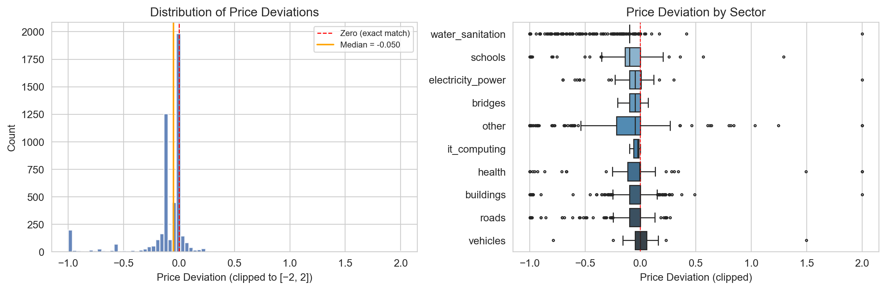
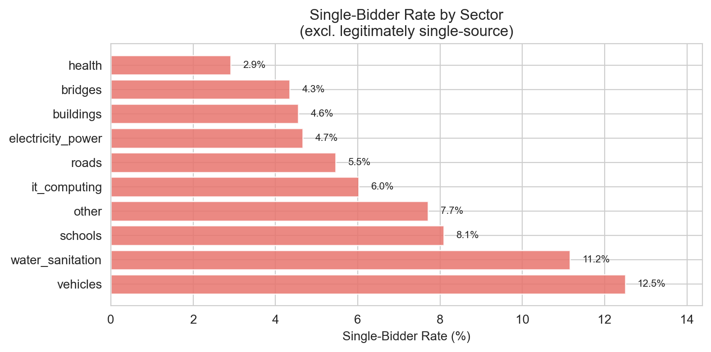
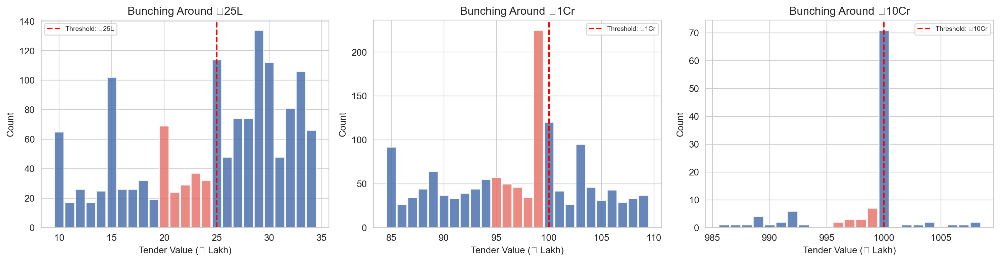
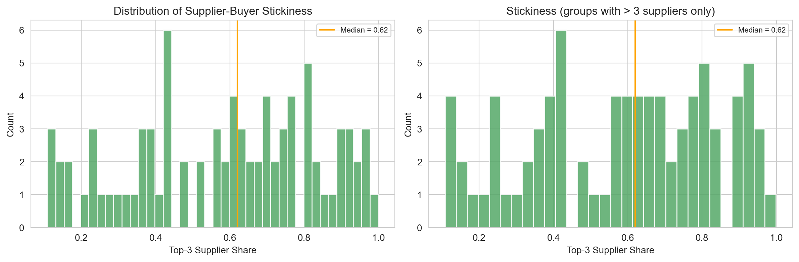
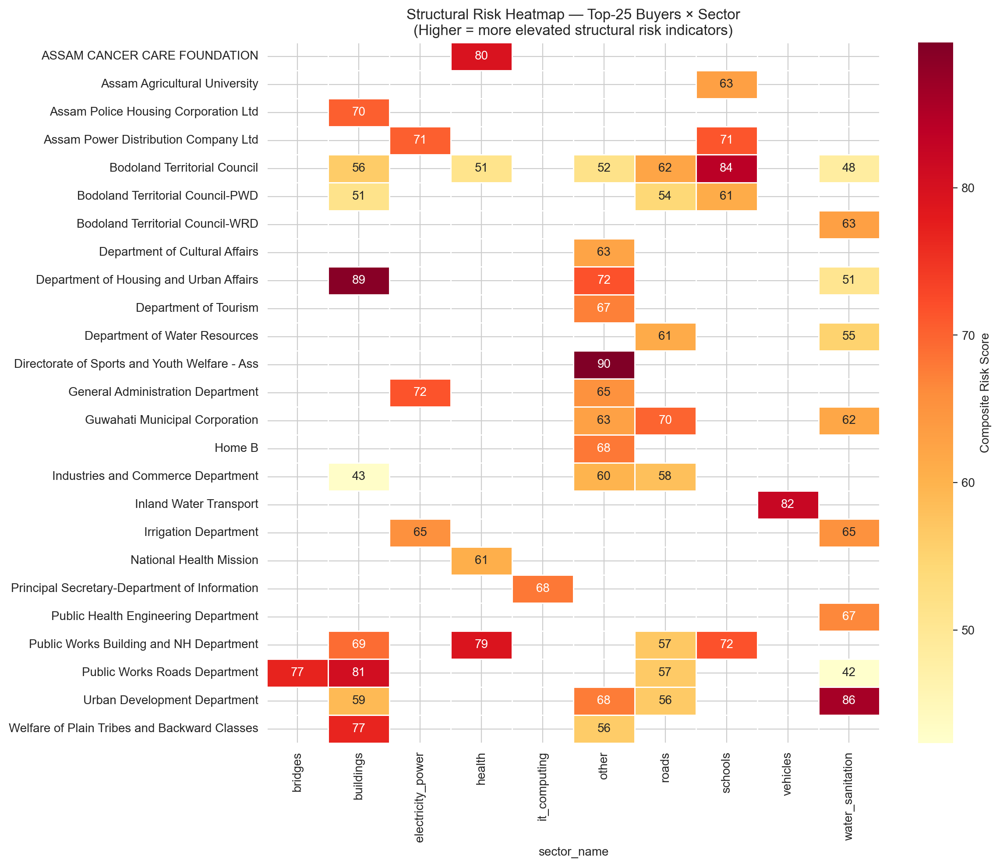

# Chapter B: Structural Integrity Indicators (RQ2)

## 1. Question and Motivation
**Research Question:** What structural integrity indicators characterize Assam procurement, and which buyer × sector combinations show elevated composite risk scores?

Public procurement is vulnerable to inefficiencies and restricted competition. Rather than relying solely on post-hoc audits of individual contracts, we use a systematic data-driven approach based on the Government Transparency Institute (Fazekas et al.) methodology. This identifies objective patterns in tendering that correlate with restricted competition. Identifying elevated structural risk indicators allows oversight resources to be targeted more effectively.

## 2. Methodology
We analyze five structural integrity indicators computed at the buyer × sector level for the FY 2020-23 period.

*   **Price Deviation:** The median of `(award_value - tender_value) / tender_value`. Values are winsorized at [-2.0, 2.0]. Higher deviation (less competitive discount) indicates higher risk.
*   **Single-Bidder Rate:** The share of tenders receiving exactly one bid, excluding legitimately single-source methods (`procurement_method = "Single"`). Computed using bid-detail records.
*   **Non-Open Method Share:** The share of a buyer's tenders using methods other than "Open Tender".
*   **Threshold Bunching:** The excess mass of tender values just below statutory thresholds (₹25 Lakh, ₹1 Crore, ₹10 Crore), measured by comparing the density in the 5 Lakh bin just below the threshold against the average of surrounding bins.
*   **Supplier-Buyer Stickiness:** The percentage of a buyer's total award value going to its top-3 suppliers.

**Composite Score:** Each indicator is converted to a percentile rank (0-100) within its sector to ensure within-sector comparability. The final composite score is an equal-weighted average of the five percentiles.

To ensure fair comparison, we partition the dataset into two regimes based on buyer names: **Domestic Procurement** (following Indian GFR) and **Externally-Funded Procurement** (following World Bank, ADB, or JICA guidelines). The headline rankings and analysis focus solely on the Domestic panel, while Externally-Funded results are summarized separately.

## 3. Findings

### Price Deviation
The overall median price deviation for the clean subset is negative (-0.06), indicating a baseline competitive discount. However, this varies significantly across sectors and buyers.

### Single-Bidder Rate
Globally, ~6% of tenders with bid data received exactly one bid. Sectoral variation is stark, with some sectors exhibiting elevated structural single-bidder rates. The highest-flagged cells include the **Department of Cultural Affairs** (other) at 61.0% single-bidder (a 10× deviation from the baseline), and the **Department of Housing and Urban Affairs** (buildings) at 16.7%.

### Non-Open Method Share
While 98.2% of all tenders use the "Open Tender" method, a small number of buyer × sector combinations rely heavily on limited or restricted methods, which elevates their structural risk profile.

### Threshold Bunching
We observe noticeable bunching below the ₹1 Crore threshold (excess mass ratio ~1.7), suggesting potential contract sizing patterns warranting scrutiny. The ₹25 Lakh and ₹10 Crore thresholds do not show significant bunching.

### Supplier-Buyer Stickiness
Stickiness is exceptionally high across the dataset. The unfiltered median buyer awards 100% of their sector value to their top 3 suppliers, but this is largely a mechanical result of small portfolios (e.g., exactly 3 suppliers). When filtering strictly for competitive markets (5 or more active suppliers), the median top-3 supplier share is 60.9%, revealing that substantial concentration persists even in markets capable of broader competition.

### Highest-Impact Cells
Among the largest single procurement portfolios in Assam, the following exhibit composite risk scores above the within-sector median, highlighting where substantial fiscal footprints intersect with structural risk. This ranking surfaces the cells with the largest fiscal footprint:

1. **Public Works Building and NH Department** (buildings): n=877, composite=72.5
2. **Assam Power Distribution Company Ltd** (electricity_power): n=489, composite=65.6
3. **Public Works Roads Department** (bridges): n=59, composite=73.2

### Composite Risk and Top Pairings
The composite risk score successfully differentiates portfolios. *Top-N ranking is stable across MIN_TENDERS_FOR_COMPOSITE values of {10, 15, 20} — Spearman ρ > 0.89.*

**Top-5 Domestic Buyer × Sector Risk Pairings (Minimum 15 Tenders):**
1. **Urban Development Department** (water_sanitation)
2. **Department of Cultural Affairs** (other)
3. **Department of Housing and Urban Affairs** (buildings)
4. **Elementary Education Department** (schools)
5. **Guwahati Municipal Corporation** (buildings)

### Panel B: Externally-Funded Procurement
Externally-funded projects (e.g., World Bank, ADB, JICA) operate under distinct international procurement guidelines rather than domestic GFR. While we summarize their metrics separately—such as the elevated risk scores seen in **Public Works Roads Department-Externally Aided Project** (roads) and **Finance Department - World Bank Tenders** (other)—these are not ranked against the domestic baseline due to differing statutory thresholds and market structures.

## 4. Limitations
*   **Selection Bias:** Because we only have award values for ~29% of tenders, indicators relying on award values (Price Deviation, Stickiness) describe the *awarded subset*, not all procurement.
*   **Missing Bid Data:** 26.4% of tenders lack detailed bid records, removing them from the single-bidder calculation denominator.
*   **Indicator Nature:** These metrics are *structural risk indicators*, not evidence of impropriety. High scores warrant scrutiny, not automatic condemnation.

## 5. Implications for Recommendations
*   **Targeted Oversight:** Buyer × sector combinations with high composite scores should be prioritized for routine qualitative audits.
*   **Threshold Review:** The bunching around the ₹1 Crore mark implies that oversight and approval requirements triggered at this threshold should be reviewed for effectiveness.
*   **Sector-Specific Baselines:** The wide variance in single-bidder rates across sectors confirms that competition guidelines must be sector-specific rather than universal.
